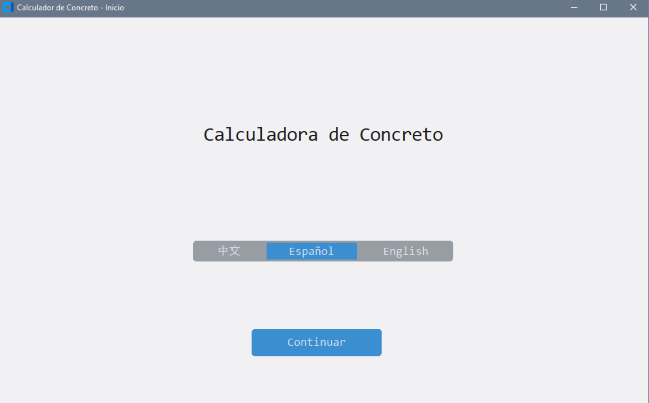
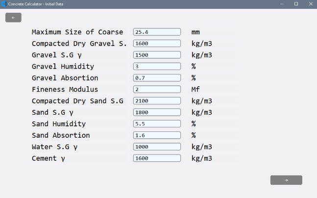
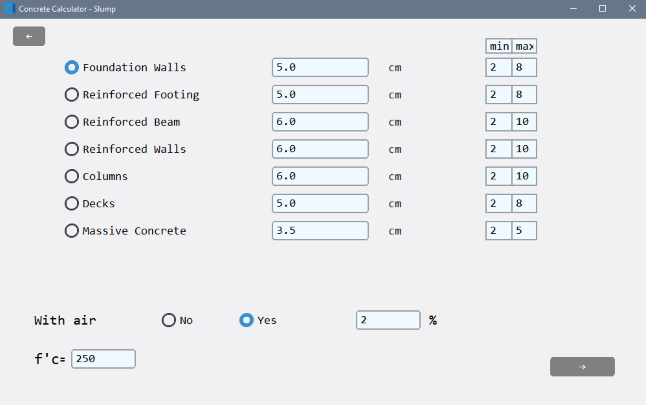
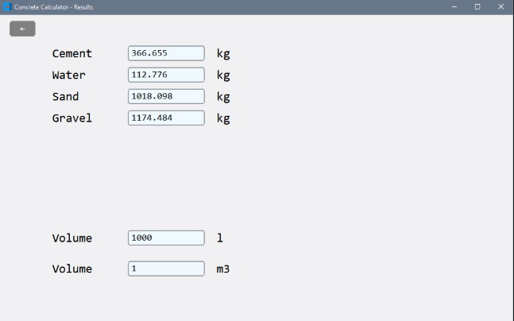

# Concrete Calculator

This is a desktop app to determine the concrete quantification scientifically. It requires data from a sieve analysis and properties of the aggregate such as absortion, humidity and specific gravity.
It is translated to Spanish, English and Chinese.

---
### Example

 
 
 